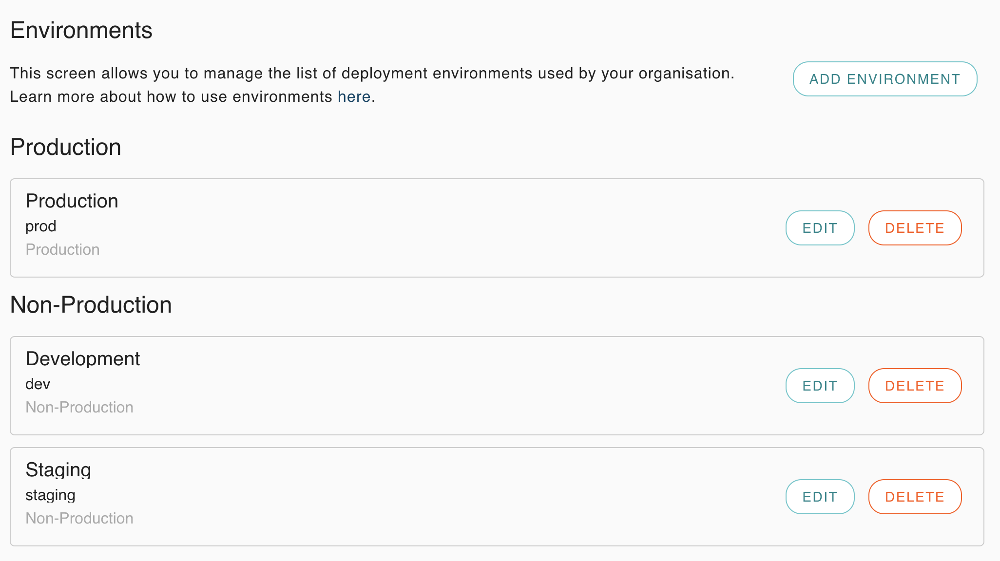
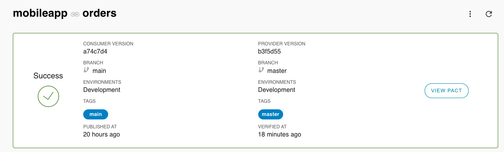
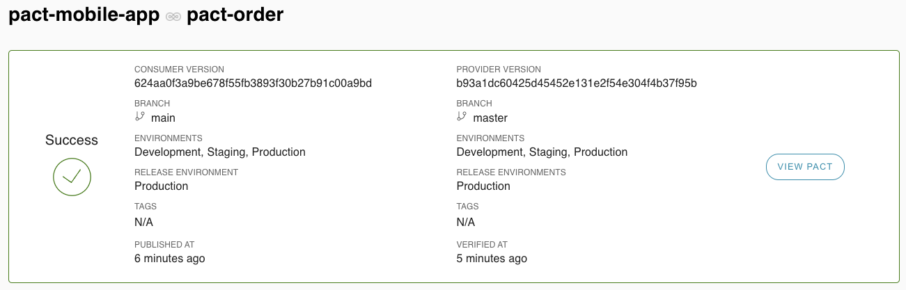

# PACT Provider example
  
### Setup:
1. Get (and set) your PACT environment variables by clicking 'Copy Env Vars' for [Read/write token (CI)](https://[user].pactflow.io/settings/api-tokens).  
   (used in pact section of [build.gradle](build.gradle))
```
export PACT_BROKER_BASE_URL=https://[user].pactflow.io
export PACT_BROKER_TOKEN=NotMyRealBrokerToken
```
2. Create dev, staging and prod [environments](https://[user].pactflow.io/settings/environments) in pactflow
   
   Remember to mark 'prod' as a Production environment when asked.
3. Download the standalone [pact-cli](https://github.com/pact-foundation/pact-ruby-standalone/releases) and add to your $PATH `export PATH=$HOME/bin/pact/bin:$PATH`
   or via [brew](https://github.com/pact-foundation/homebrew-pact-ruby-standalone)
4. 
### Run (No publish) the provider tests:
1. `/gradlew clean pactTest --tests "*ProviderPactTest"`

### Run and Publish the results of the provider tests:
1. `./gradlew clean -DpactPublishResults=true test --tests "*ProviderPactTest"`  
The provider version and branch are also set.  See test section of [build.gradle](build.gradle)

### Can I deploy
Choose one of the following options:
1. gradle: At time of writing the pact gradle canIDeploy task does not support branches and environments.
2. pact-cli: ```pact-broker can-i-deploy --pacticipant=$(basename `git rev-parse --show-toplevel`) --version=$(git rev-parse HEAD) --branch=$(git rev-parse --abbrev-ref HEAD) --to-environment=dev```  
   ** Remember to replace the `--to-environment` with the environment you want to check if you can deploy too.

To get can-i-deploy to pass you need to make sure all consumer tests have passed. See [pact-mobile-app](https://github.com/nathandeamer/pact-mobile-app)

### Record a deployment
After the provider tests have passed and the service has been deployed to an environment we should [record a deployment](https://docs.pact.io/pact_broker/recording_deployments_and_releases)

Choose one of the following options:
1. gradle: At time of writing the pact gradle plugin does not support recording a deployment
2. pact-cli: ```pact-broker record-deployment --pacticipant=$(basename `git rev-parse --show-toplevel`) --version=$(git rev-parse HEAD) --environment=dev```



### Record a release
When a version has been deployed to production we should record a release.
1. gradle: At time of writing the pact gradle plugin does not support recording a deployment
2. pact-cli: ```pact-broker record-release --pacticipant=$(basename `git rev-parse --show-toplevel`) --version=$(git rev-parse HEAD) --environment=prod```


