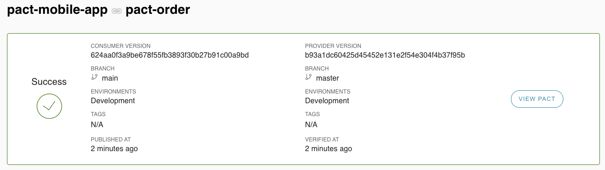

# PACT Provider example
 
### Setup:
1. Get (and set) your PACT environment variables by clicking 'Copy Env Vars' for [Read/write token (CI)](https://[user].pactflow.io/settings/api-tokens).  
   (used in pact section of [build.gradle](build.gradle))
```
export PACT_BROKER_BASE_URL=https://[user].pactflow.io
export PACT_BROKER_TOKEN=NotMyRealBrokerToken
```
2. Create dev, staging and prod [environments](https://[user].pactflow.io/settings/environments) in pactflow
   
   Remember to mark 'prod' as a Production environment when asked.
3. Download the standalone [pact-cli](https://github.com/pact-foundation/pact-ruby-standalone/releases) and add to your $PATH `export PATH=$HOME/bin/pact/bin:$PATH`

### Run (No publish) the provider tests:
1. `/gradlew test --tests "*ProviderPactTest"`

### Run and Publish the results of the provider tests:
1. `./gradlew -DpactPublishResults=true test --tests "*ProviderPactTest"`  
The provider version and branch are also set.  See test section of [build.gradle](build.gradle)

### Record a deployment
After the provider tests have passed and the service has been deployed to an environment we should [record a deployment](https://docs.pact.io/pact_broker/recording_deployments_and_releases)

Choose one of the following options:
1. gradle: At time of writing the pact gradle plugin does not support recording a deployment
2. pact-cli: `pact-broker record-deployment --pacticipant=orders --version=$(git rev-parse --short HEAD) --environment=dev`
3. docker:
```
docker run --rm \
        -e PACT_BROKER_BASE_URL \
        -e PACT_BROKER_TOKEN \
        pactfoundation/pact-cli:latest \
        broker record_deployment \
        --pacticipant=orders \
        --version=$(git rev-parse --short HEAD) \
        --environment=dev
```



### Record a release
When a version has been deployed to production we should record a release.
1. gradle: At time of writing the pact gradle plugin does not support recording a deployment
2. pact-cli: `pact-broker record-release --pacticipant=orders --version=$(git rev-parse --short HEAD) --environment=prod`
3. docker:
```
docker run --rm \
        -e PACT_BROKER_BASE_URL \
        -e PACT_BROKER_TOKEN \
        pactfoundation/pact-cli:latest \
        broker record_release \
        --pacticipant=orders \
        --version=$(git rev-parse --short HEAD) \
        --environment=prod
```


## Generate network graph:

1. Install graphviz (`brew install graphviz`)

```
echo "digraph { ranksep=3; ratio=auto; overlap=false; node [  shape = plaintext, fontname = "Helvetica" ];" > latest.dot
curl -H 'Authorization: Bearer '"$PACT_BROKER_TOKEN"'' $PACT_BROKER_BASE_URL/pacts/latest | jq '.pacts[]._embedded | .consumer.name + "->" + .provider.name' | tr -d '"' |  sed 's/-/_/g' | sed 's/_>/->/g' >> latest.dot; echo "}" >> latest.dot
dot latest.dot -opact-network.png -Tpng
open pact-network.png
```


